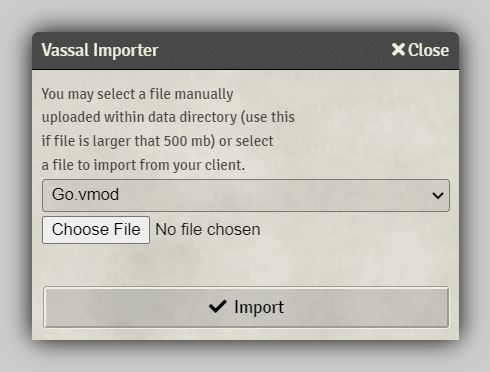
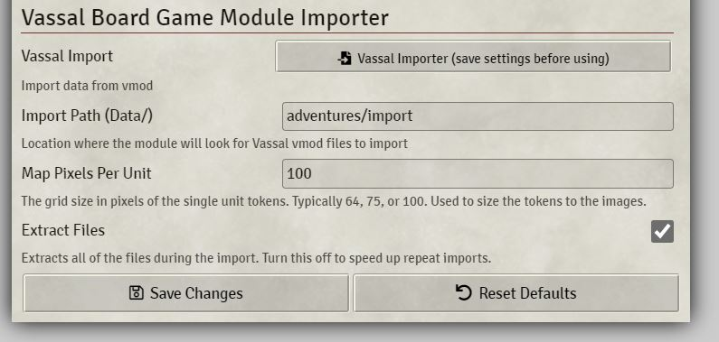

# Vassal Import

A module for importing Vassal Board Game modules into http://foundryvtt.com/.

**MANIFEST URL: https://raw.githubusercontent.com/Bryan-Legend/vassal-import/master/module.json**

## How To Use

### Import

To import a file, first install the module and go to the module settings to set an import path within the data location.  If you click `Vassal Import` this will create the folder location on the server where you can place the vassal file.  Place the file in the folder and go back to the module settings (you may have to close the settings and reopen for the module to populate the file selector dropdown).  Select the file to import and click import.  The module will create all assets within the adventure (scenes, actors, and playlists), and all images/sounds included as well.

## Important Notes

Importing will create a scene and actor folder of the name of the module.
In order for the import to be re-runnable the existing scenes in the import scene folder will be deleted.
Re-running an import will double deck card collections, actors, and journals. So you may need to clear those out before you re-run an import.

Foundry defaults to 100px grid images. Some Vassal modules image sets are designed for a 64 pixel grid. Some are set to 75px. You'll need to select that as an option, or maybe you could set it on the scenes.

This module code base was originally from Adventure Import Export (https://github.com/cstadther/adventure-import-export).

## Recommended Modules

* Moar Folders (https://github.com/KayelGee/moar-folders) - Actor imports are often several levels deep and Foundry has a limitation of 3 folder depth. Six seems to be enough. The data will import correctly but once you pass 3 folders it will start spamming the root folder heavily. Turning on this mod will fix.

* Card Support (https://github.com/spacemandev-git/fvtt-card-support) - You will need to refresh the browser after an import before decks will work. You will likely want to make everyone a GM if you use this so that everyone can use the tile layer to manipulate the decks. Drag deck folders in the Journal tab onto the tile layer of a scene.

## Todo

* Convert to typescript
* Dice so Nice integration
* Dice Tray integration
* .vsav file format import for better scene data
* prototype import for better token data
* gif image conversion to webp since foundry does not support gif at all
* playlist generator for audio
* Use extracted fonts somehow
* Recommend a default game system. Maybe do some stat importing or something.
* Add a scene for each map picker option.
* Import grid config data.
